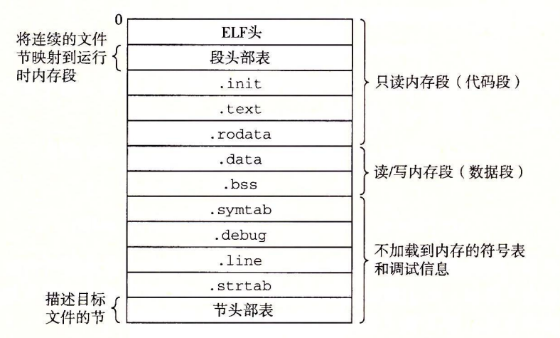
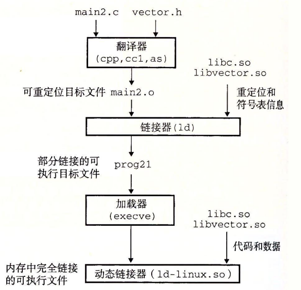

# 第七章 链接

链接是将各种代码和数据片段收集并组合成一个单一的文件。

本章，探索在linux系统上，如何构建和运行应用软件。

## 1程序编译执行的总体过程

考虑有两个C文件：

```c
// main.c
int sum(int *a, int n);

int array[2] = {1, 2};

int main()
{
    int val = sum(array, 2);
    return val;
}
```

```c
// sum.c
int sum(int *a, int n)
{
    int i, s = 0;
    
    for (i = 0; i < n; i++) {
        s += a[i];
    }
    return s;
}
```

大多数编译系统提供编译器驱动程序（compiler driver），它代表用户在需要时调用语言预处理器、编译器、汇编器和链接器。比如，要用 GNU 编译系统构造示例程序，我们就要通过在 shell 中输入下列命令来调用 GCC 驱动程序

编译链接两个可C文件成为可执行文件的过程如图:


第一步，对源代码做预处理操作，主要是处理那些源文件和头文件中以 # 开头的命令（比如 #include、#define、#ifdef 等），并删除程序中所有的注释 // 和 /*...*/等，使用`gcc -E`参数：

```shell
#运行  C 预处理器（cpp），将 C 的源程序 main.c 翻译成一个中间文件 main.i
cpp main.c main.i
# 或者直接使用gcc -E选项
gcc -E main.c -o main.i
```

第二步，就是将预处理得到的程序代码，经过一系列的词法分析、语法分析、语义分析以及优化，编译加工为当前机器支持的汇编代码。将main.i翻译为ASCII汇编语言文件main.s，使用`gcc -S`参数：

```shell
# 运行 C 编译器（cc1），它将 main.i 翻译成一个汇编语言文件 main.s
cc1 main.i -o main.s
# 或者直接使用gcc -S 选项
gcc -S main.i -o main.s
```

第三步，对已得到的 main.s 执行汇编操作，并得到相应的目标文件。所谓目标文件，其本质为二进制文件，但由于尚未经过链接操作，所以无法直接运行。使用`gcc -c`选项：

```shell
# 者直接使用汇编器，将 main.s 翻译成一个可重定位目标文件
as main.s -o main.o
# 或者直接使用gcc -c选项
gcc -c main.s -o main.o
```

第四步，运行链接器程序ld，将 main.o 和 sum.o 以及一些必要的系统目标文件组合起来，创建一个可执行目标文件。或者使用`gcc -c`命令：

```shell
# 运行链接器程序ld，将main.o和sum.o以及一些必要的系统目标文件组合起来，创建一个可执行目标文件
ld main.o sun.o -o proc
# 或者直接使用gcc -c选项
gcc -c main.o sun.o -o proc
```

最后，shell调用操作系统中一个叫做加载器（loader）的函数，它将可执行文件proc中的代码和数据复制到内存，然后将控制转移到这个程序的开头。

## 2可重定位文件

汇编器编译汇编语言文件，生成**可重定位文件**，包含二进制代码和数据，其形式可以在编译时与其他可重定位目标文件合并起来，创建一个可执行目标文件。

### 2.1可重定位文件构成

下图展示了一个典型的 ELF 可重定位目标文件的格式。


- ELF头：ELF 头（ELF header）以一个 16 字节的序列开始，这个序列描述了生成该文件的系统的字的大小和字节顺序。ELF 头剩下的部分包含帮助链接器语法分析和解释目标文件的信息。其中包括 ELF 头的大小、目标文件的类型（如可重定位、可执行或者共享的）、机器类型（如 X86-64）、节头部表（section header table）的文件偏移，以及节头部表中条目的大小和数量。

- 节头部表：不同节的位置和大小是由节头部表描述的，其中目标文件中每个节都有一个固定大小的条目（entry）。

- .text：已编译程序的机器代码。

- .rodata：只读数据，比如 printf 语句中的格式串和switch语句的跳转表。

- .data：已初始化的全局和静态 C 变量，需要在文件保存初始值。

- .bss（Better Save Space）：未初始化的全局和静态 C 变量，以及所有被初始化为 0 的全局或静态变量。在目标文件中这个节不占据实际的空间，它仅仅是一个占位符。目标文件格式区分已初始化和未初始化变量是为了空间效率：在目标文件中，未初始化变量不需要占据任何实际的磁盘空间。运行时，在内存中分配这些变量，初始值为 0。
  
- .symtab：一个符号表，它存放在程序中定义和引用的函数和全局变量的信息。

- .rel.text：一个 .text 节中位置的列表，当链接器把这个目标文件和其他文件组合时，需要修改这些位置。一般而言，任何调用外部函数或者引用全局变量的指令都需要修改。
  
- .rel.data：被模块引用或定义的所有全局变量的重定位信息。一般而言，任何已初始化的全局变量，如果它的初始值是一个全局变量地址或者外部定义函数的地址，都需要被修改。

- .debug：一个调试符号表，其条目是程序中定义的局部变量和类型定义，程序中定义和引用的全局变量，以及原始的 C 源文件。只有以 - g 选项调用编译器驱动程序时，才 会得到这张表。

- .line：原始 C 源程序中的行号和 .text 节中机器指令之间的映射。只有以 -g 选项调用编译器驱动程序时，才会得到这张表。

- .strtab：一个字符串表，其内容包括 .symtab 和 .debug 节中的符号表，以及节头部中的节名字。字符串表就是以 null 结尾的字符串的序列。

### 2.2符号表

**符号**：编译器输出到汇编语言.s文件中的符号，再由汇编器构造，并生成到.o文件中的`.symtab`节。

用来描述链接过程中，可大致分为三种不同的符号：

(1) 模块自身定义，并能够被其他模块引用的全局符号；

(2) 其他模块定义，被自身引用的全局符号；

(3) 只被自身模块定义和引用的模块，如被static修饰的C函数和全局变量。

.symtab 节中包含 ELF 符号表。这张符号表包含一个条目的数组，每个数据元素表述一个符号。下图展示了每个条目的格式。

```c
typedef struct {
    // 字符串表中的字节偏移
    int     name;      /* String table offset */
    // 数据or函数
    char    type:4,    /* Function or data (4 bits) */
    //全局or局部符号
            binding:4; /* Local or global (4 bits) */
    //保留字段
    char    reserved;  /* Unused */
    //本符号指向数据的节索引,也可以认为是到节头部表的偏移
    short   section;   /* Section header index */
    //节内数据的偏移，或者干脆就是绝对地址
    long    value;     /* Section offset or absolute address */
    //符号指向数据的大小
    long    size;      /* Object size in bytes */
} Elf64_Symbol;
```

有三个特殊的伪节（pseudosection），它们在节头部表中是没有条目的：

- ABS 代表不该被重定位的符号；

- UNDEF 代表未定义的符号，也就是在本目标模块中引用，但是却在其他地方定义的符号；

- COMMON 表示还未被分配位置的未初始化的**全局变量**。

以下是对7.1中生成main.o文件，使用`readelf -a main.o`查看符号表：


在这里，又对未初始化的变量进行区分：

- COMMON：未初始化的**全局变量**；

- .bss：未初始化的静态变量，以及**初始化为0的全局或静态变量**。

### 2.3 符号解析

对符号引用的解析，链接器要**将每个引用**与它其他可重定位目标文件中的**符号表中的已明确定义的符号关联起来**。

符号引用的解析，有以下规则：

(1) 局部符号的引用：符号的引用与定义只在当前模块（比如静态局部变量），编译器只允许每个局部符号在当前模块中，只有一个定义。

（2）全局符号的引用，又有3个规则：

- 规则 1：不允许有多个同名的强符号。

- 规则 2：如果有一个强符号和多个弱符号同名，那么选择强符号。
  
- 规则 3：如果有多个弱符号同名，那么从这些弱符号中任意选择一个。

上述，符号强弱的定义：函数和已初始化的全局变量是强符号，未初始化的全局变量是弱符号。

这这里，就可以理解为什么要在可重定位文件中，把未初始化的变量分为.bss和COMMOM节。

因为未初始化的全局变量属于弱符号，它并不知道其他模块是否也定义了同名同类型符号，因此把链接的决定权留给了链接器。

### 2.4 链接静态库

相关的函数可以被编译为独立的目标模块，然后封装成一个单独的静态库文件。然后，应用程序可以通过在命令行上指定单独的文件名字来使用这些在库中定义的函数。

```shell
gcc main.c /usr/lib/libm.a /usr/lib/libc.a
```

在链接时，链接器将只复制被程序引用的目标模块，这就减少了可执行文件在磁盘和内存中的大小。

在 Linux 系统中，静态库以一种称为存档（archive）的特殊文件格式存放在磁盘中。存档文件是一组连接起来的可重定位目标文件的集合，有一个头部用来描述每个成员目标文件的大小和位置。存档文件名由后缀 .a 标识。

要创建这些函数的一个静态库，我们将使用 AR 工具，如下：

```shell
gcc -c addvec.c multvec.c
ar rcs libvector.a addvec.o multvec.o
```

下图，概括了链接器的行为。


在符号解析阶段，链接器从左到右按照它们在编译器驱动程序命令行上出现的顺序来扫描可重定位目标文件和存档文件。（驱动程序自动将命令行中所有的.c文件翻译为.o文件。）在这次扫描中，链接器维护一个可重定位目标文件的集合 E（这个集合中的文件会被合并起来形成可执行文件），一个未解析的符号（即引用了但是尚未定义的符号）集合 U，以及一个在前面输入文件中已定义的符号集合 D。初始时，E、U 和 D 均为空。

- 对于命令行上的每个输入文件 f，链接器会判断 f 是一个目标文件还是一个存档文件。如果 f 是一个目标文件，那么链接器把 f 添加到 E，修改 U 和 D 来反映 f 中的符号定义和引用，并继续下一个输入文件。
  
- 如果 f 是一个存档文件，那么链接器就尝试匹配 U 中未解析的符号和由存档文件成员定义的符号。如果某个存档文件成员 m，定义了一个符号来解析 U 中的一个引用，那么就将 m 加到 E 中，并且链接器修改 U 和 D 来反映 m 中的符号定义和引用。对存档文件中所有的成员目标文件都依次进行这个过程，直到 U 和 D 都不再发生变化。此时，任何不包含在 E 中的成员目标文件都简单地被丢弃，而链接器将继续处理下一个输入文件。

- 如果当链接器完成对命令行上输入文件的扫描后，U 是非空的，那么链接器就会输出一个错误并终止。否则，它会合并和重定位 E 中的目标文件，构建输岀的可执行文件。

### 2.5 重定位符号引用

一旦链接器完成了符号解析这一步，就把代码中的每个符号引用和正好一个符号定义关联起来,即每个模块的符号表条目都有输入目标模块中符号表的一个条目与之对应。

此时，链接器就知道它的输入目标模块中的代码节和数据节的确切大小，将合并输入模块，并为每个符号分配运行时地址，进入重定位步骤。

重定位由两步组成：重定位节/符号定义和重定位节中的符号引用。

- 重定位节/符号定义：链接器将所有相同类型的节合并为同一类型的新的聚合节。例如，来自所有输入模块的. data 节被全部合并成一个节，这个节成为输出的可执行目标文件的. data 节。然后，链接器将运行时内存地址赋给新的聚合节，赋给输入模块定义的每个节，以及赋给输入模块定义的每个符号。**当这一步完成时，程序中的每条指令和全局变量都有唯一的运行时内存地址了**。

- 重定位节中的符号引用：链接器修改代码节和数据节中对每个**符号的引用**。

当汇编器生成一个目标模块时，它并不知道数据和代码最终将放在内存中的什么位置。它也不知道这个模块引用的任何外部定义的函数或者全局变量的位置。所以，无论何时汇编器遇到对最终位置未知的目标引用，它就会生成一个重定位条目，告诉链接器在将目标文件合并成可执行文件时如何修改这个引用。代码的重定位条目放在 .rel.text 中。已初始化数据的重定位条目放在 .rel.data 中。

.rel.text/.rel.data中每个条目，要表述当前符号引用的位置，以及引用目标符号的位置，其数据结构如下：

```c
typedef struct {
    long offset;    /* Offset of the reference to relocate */
    long type:32,   /* Relocation type */
         symbol:32; /* Symbol table index */
    long addend;    /* Constant part of relocation expression */
} Elf64_Rela;
```

offset 是需要被修改的引用的节偏移。symbol 标识被修改引用应该指向的符号。type 告知链接器如何修改新的引用。addend 是一个有符号常数，一些类型的重定位要使用它对被修改引用的值做偏移调整。

## 3 生成可执行目标文件

结果符号解析，符号重定位，链接器链接之后，形成了可**执行**目标文件，格式如下图所示。


与可重定位目标文件相比，发生了一下变化：

- 增加了程序入口（entry point）: 在elf header中，添加了程序运行时要执行的第一条指令的地址（Entry point address）。

- 增加.init节:  _init函数，程序的初始化代码会调用它。

- 删除了.rel.xxx节: 结果链接后，可执行文件已被重定位，不再需要 .rel节。

- 增加程序头部表：用来表述可执行文件的连续的片（chunk）到连续的内存段的映射关系。

```shell
readelf -l addvec.c proc

File: proc

Elf file type is EXEC (Executable file)
Entry point 0x400ed0
There are 6 program headers, starting at offset 64

Program Headers:
  Type           Offset             VirtAddr           PhysAddr
                 FileSiz            MemSiz              Flags  Align
  LOAD           0x0000000000000000 0x0000000000400000 0x0000000000400000
                 0x00000000000bca01 0x00000000000bca01  R E    200000
  LOAD           0x00000000000bceb0 0x00000000006bceb0 0x00000000006bceb0
                 0x00000000000018a0 0x0000000000003a38  RW     200000
  NOTE           0x0000000000000190 0x0000000000400190 0x0000000000400190
                 0x0000000000000044 0x0000000000000044  R      4
  TLS            0x00000000000bceb0 0x00000000006bceb0 0x00000000006bceb0
                 0x0000000000000020 0x0000000000000058  R      10
  GNU_STACK      0x0000000000000000 0x0000000000000000 0x0000000000000000
                 0x0000000000000000 0x0000000000000000  RW     10
  GNU_RELRO      0x00000000000bceb0 0x00000000006bceb0 0x00000000006bceb0
                 0x0000000000000150 0x0000000000000150  R      1
```

对于任何一个段，链接器必须选择一个起始地址 vaddr，使得 `vaddr mod align = off mod align`。这个对齐要求是一种优化，使得当程序执行时，目标文件中的段能够很有效率地传送到内存中。 这样对齐的原因，是因为虚拟内存的关系（后面学）。

## 4 加载执行目标文件

一个可执行文件的运行，需要通过调用某个驻留在存储器中称为加载器（loader）的操作系统代码来运行它。加载器将可执行目标文件中的代码和数据从磁盘复制到内存中，然后通过跳转到程序的第一条指令或入口点来运行该程序。这个**将程序复制到内存并运行的过程叫做加载**。

每个 Linux 程序都有一个运行时内存映像，类似于下图所示。



在程序头部表的引导下，加载器将可执行文件的片（chunk）复制到代码段和数据段。

接下来，加载器跳转到程序的入口点，也就是 _start函数的地址。这个函数是在系统目标文件ctrl.o中定义的，对所有的C程序都是一样的。

_start函数调用系统启动函数__libc_start_main，该函数定义在 libc.so 中。

它初始化执行环境，调用用户层的 main 函数，处理main函数的返回值，并且在需要的时候把控制返回给内核。

## 5 动态库

静态库缺陷：

- 同一份代码被到处复制到每个进程的代码段中，浪费内存空间；

- 静态库需要修改时，引用方需要重新编译打包。

为解决静态库的缺陷，引入了**共享库**。

共享库是一个目标文件，共享库也称为共享目标（shared object），在 Linux 系统中通常用 .so 后缀来表示。共享库可以加载到任意内存地址，并且和一个内存中的进程链接起来。这个过程称为动态链接，由动态链接器来执行。

共享库是以两种不同的方式来“共享”的。

首先，在任何给定的文件系统中，对于一个库只有一个. so 文件。所有引用该库的可执行目标文件共享这个 .so 文件中的代码和数据，而不是像静态库的内容那样被复制和嵌入到引用它们的可执行的文件中。

其次，在内存中，一个共享库的 .text 节的一个副本可以被不同的正在运行的进程共享。


