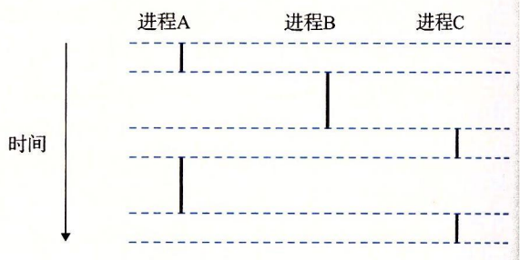

# 8 进程控制

## 8.1 异常

异常就是控制流的突变，用来响应处理器中的某些变化。它一部分由硬件实现，一部分由操作系统实现。

当处理器监测到由事件发生时，他就通过一张叫异常表的跳转表进行间接的过程调用，跳转到一个专门用来处理这类事件的操作系统子程序。异常处理完成后：

- 处理器返回给事件发生时，正在执行的指令。

- 处理器返回给事件发生时，正在执行的下一条指令。

- 处理器程序被终止。

异常可以分为四类：中断（interrupt），陷阱（trap）、故障（fault）和终止（abort）。

| 类别 | 原因                | 异步/同步 | 返回行为             |
| ---- | ------------------- | --------- | -------------------- |
| 中断 | 来自 I/O 设备的信号 | 异步      | 总是返回到下一条指令 |
| 陷阱 | 有意的异常          | 同步      | 总是返回到下一条指令 |
| 故障 | 潜在可恢复的错误    | 同步      | 可能返回到当前指令   |
| 终止 | 不可恢复的错误      | 同步      | 不会返回             |

**中断**：是异步发生的，是来自处理器外部的 I/O 设备的信号的结果。**硬件中断不是由任何一条专门的指令造成的**，从这个意义上来说它是异步的。I/O 设备，例如网络适配器、磁盘控制器和定时器芯片，通过向处理器芯片上的一个引脚发信号，并将异常号放到系统总线上，来触发中断，这个异常号标识了引起中断的设备。

**陷阱**：是有意的异常，是执行一条指令的结果。就像中断处理程序一样，陷阱处理程序将控制返回到下一条指令。**陷阱最重要的用途是在用户程序和内核之间提供一个像过程一样的接口**，叫做系统调用。用户程序经常需要向内核请求服务，比如读一个文件（read）、创建一个新的进程（fork），加载一个新的程序（execve），或者终止当前进程（exit）。**为了允许对这些内核服务的受控的访问，处理器提供了一条特殊的 “syscall n” 指令**，当用户程序想要请求服务 n 时，可以执行这条指令。执行 syscall 指令会导致一个到异常处理程序的陷阱，这个处理程序解析参数，并调用适当的内核程序。

**故障**：由错误情况引起，它可能能够被故障处理程序修正。当故障发生时，处理器将控制转移给故障处理程序。如果处理程序能够修正这个错误情况，它就将控制返回到引起故障的指令，从而重新执行它。否则，处理程序返回到内核中的 abort 例程，abort 例程会终止引起故障的应用程序。一个**经典的故障示例是缺页异常**。

**终止**：是不可恢复的致命错误造成的结果，通常是一些硬件错误，比如 DRAM 或者 SRAM 位被损坏时发生的奇偶错误。

## 8.2 进程概念

**进程**的经典定义就**是一个执行中程序的实例**。每个程序都运行在某个进程的上下文（context）中，包含了正确运行所需的状态。这个状态包括存放在内存中的程序的代码和数据，它的栈、通用目的寄存器的内容、程序计数器、环境变量以及打开文件描述符的集合。

进程提供给应用程序的关键抽象：

- 一个独立的逻辑控制流，它提供一个假象，好像我们的程序独占地使用处理器。

- 一个私有的地址空间，它提供一个假象，好像我们的程序独占地使用内存系统。

### 8.2.1 并发与并行流

一系列程序执行指令称为逻辑控制流。

**一个逻辑流的执行在时间上与另一个流重叠**，称为**并发流**（concurrent flow），这两个流被称为并发地运行。如下图，进程ABC可以称为互相并发，因为在执行时间上有相互重叠。

多个流并发地执行的一般现象被称为并发（concurrency）。一个进程和其他进程轮流运行的概念称为多任务（multitasking）o 一个进程执行它的控制流的一部分的每一时间段叫做时间片（time slice）。因此，多任务也叫做时间分片（timeslicing）。例如，上图中，进程 A 的流由两个时间片组成。

如果两个流并发地运行在不同的处理器核或者计算机上，那么我们称它们为**并行流**（parallel flow），它们并行地运行（running in parallel），且并行地执行（parallel execution）。

### 8.2.2 私有地址空间

进程也为每个程序提供一种假象，好像它独占地使用系统地址空间。在一台 n 位地址的机器上，地址空间是个可能地址的集合，0，1，... 2^n。进程为每个程序提供它自己的私有地址空间。

下图展示了一个 x86-64 Linux 进程的地址空间的组织结构。

### 8.2.3 用户态和内核态

为了使操作系统内核提供一个无懈可击的进程抽象，处理器必须提供一种机制，限制一个应用可以执行的指令以及它可以访问的地址空间范围。

处理器通常是用某个控制寄存器中的一个模式位（mode bit）来提供这种功能的，该寄存器描述了进程当前享有的特权：

- 当设置了模式位时，进程就运行在内核模式中（有时叫做超级用户模式）。一个运行在内核模式的进程可以执行指令集中的任何指令，并且可以访问系统中的任何内存位置。

- 没有设置模式位时，进程就运行在用户模式中。用户模式中的进程不允许执行特权指令（privileged instruction），比如停止处理器、改变模式位，或者发起一个 I/O 操作。也不允许用户模式中的进程直接引用地址空间中内核区内的代码和数据。任何这样的尝试都会导致致命的保护故障。

运行应用程序代码的进程初始时是在用户模式中的。**进程从用户模式变为内核模式的唯一方法是通过诸如中断、故障或者陷入系统调用这样的异常**。

### 8.2.4 上下文切换

操作系统内核使用一种称为上下文切换（context switch）的较高层形式的异常控制流来实现多任务。

内核为每个进程维持一个上下文（context）。**上下文就是内核重新启动一个被抢占的进程所需的状态**。它由一些对象的值组成，这些对象包括通用目的寄存器、浮点寄存器、程序计数器、用户栈、状态寄存器、内核栈和各种内核数据结构，比如描述地址空间的页表、包含有关当前进程信息的进程表，以及包含进程已打开文件的信息的文件表。

在进程执行的某些时刻，内核可以决定抢占当前进程，并重新开始一个先前被抢占了的进程。这种决策就叫做调度（scheduling），是由内核中称为调度器（scheduler）的代码处理的。当内核选择一个新的进程运行时，我们说内核调度了这个进程。在内核调度了一个新的进程运行后，它就抢占当前进程，并使用一种称为上下文切换的机制来将控制转移到新的进程，上下文切换：

1）保存当前进程的上下文，

2）恢复某个先前被抢占的进程被保存的上下文，

3）将控制传递给这个新恢复的进程。

下图展示了一对进程 A 和 B 之间上下文切换的示例。

