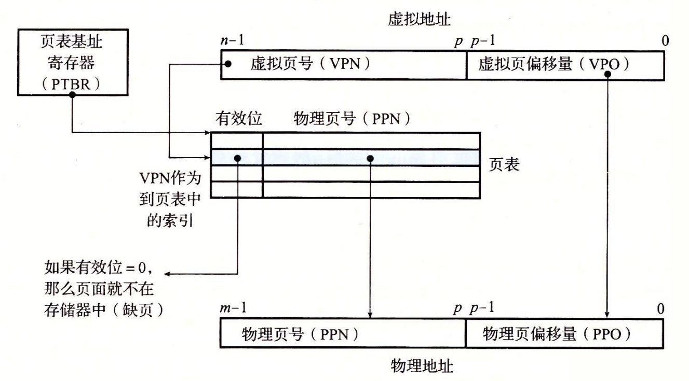
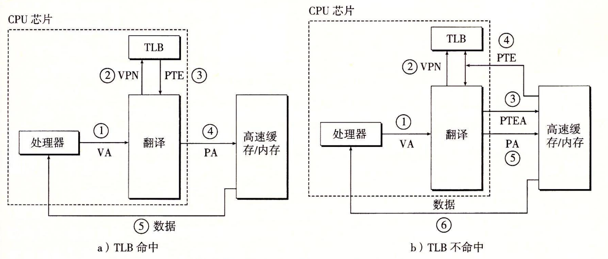

# 9 虚拟内存

## 9.1 名词解释

物理地址：计算机主存的被组织为一个连续M个字节大小的单元数组，每个字节都有唯一的地址。

虚拟地址：CPU通过生成一个逻辑上的地址来访问主存，这个地址被送到内存之前，先被翻译（使用某种约定好的规则）为物理地址。

地址空间：一个非负整数地址的集合，如果地址整数连续，就是线性地址空间。

虚拟地址空间：CPU从一个有N个地址的地址空间中，**生成虚拟地址**，这个地址空间就是虚拟地址空间。

物理地址空间：从一个有N个地址的地址空间中，**生成物理地址**，这个地址空间就是物理地址空间。

## 9.2 虚拟内存的三个特点

**虚拟内存**：一个由存放在**磁盘**上的，N个连续字节大小的单元组成的数组。每个字节都有唯一的虚拟地址，作为到数组的索引，磁盘上数组的内容被缓存在主存中。

### 9.2.1 缓存

#### 9.2.1.2 分页

从磁盘的一个扇区读取第一个字节的时间开销比起读这个扇区中连续的字节要慢大约 100000 倍。归根到底，DRAM 缓存的组织结构完全是由巨大的不命中开销驱动的。

因此，和其他存储系统一样，磁盘（较低层）上的数**据被分割成块**，这些块作为磁盘和主存（较高层）之间的传输单元。

- 虚拟存储系统通过将虚拟内存分割为大小固定的块，称为虚拟页（Virtual Page，VP）,每个虚拟页的大小为`P = 2^p`。

- 类似地，物理内存被分割为物理页（Physical Page，PP）。

虚拟页面分为三个不相交的子集：

- 未分配的：VM 系统还未分配（或者创建）的页。未分配的块没有任何数据和它们相关联，因此也就不占用任何磁盘空间。

- 已分配，未缓存的：未缓存在物理内存中的已分配页。

- 已分配，缓存的：当前已缓存在物理内存中的已分配页。

下图，展示了一个虚拟内存系统是如何使用主存作为缓存。

示例中，展示了一个有8个虚拟页的小虚拟内存。虚拟页0和3还没有被分配，因此在磁盘上还不存在。虚拟页1、4和6被缓存在物理内存中。页2、5和7已经被分配了，但是当前并未缓存在主存中。

#### 9.2.1.2 页表

同任何缓存一样，虚拟内存系统必须有某种方法来判定一个虚拟页是否缓存在 DRAM 中的某个地方。如果是，系统还必须确定这个虚拟页存放在哪个物理页中。如果不命中，系统必须判断这个虚拟页存放在磁盘的哪个位置，在物理内存中选择一个牺牲页，并将虚拟页从磁盘复制到 DRAM 中，替换这个牺牲页。

这些功能是由软硬件联合提供的，包括操作系统软件、MMU（内存管理单元）中的地址翻译硬件和一个存放在物理内存中叫做页表（page table）的数据结构，页表将虚拟页映射到物理页。每次地址翻译硬件将一个虚拟地址转换为物理地址时，都会读取页表。操作系统负责维护页表的内容，以及在磁盘与 DRAM 之间来回传送页。

上图中，展示了一个页表的基本组织结构。页表就是一个页表条目（Page Table Entry，PTE）的数组。虚拟地址空间中的每个页在页表中一个固定偏移量处都有一个 PTE。为了我们的目的，我们将假设每个 PTE 是由一个有效位（valid bit）和一个 n 位地址字段组成的。有效位表明了该虚拟页当前是否被缓存在 DRAM 中。

- 如果设置了有效位，那么地址字段就表示 DRAM 中相应的物理页的起始位置，这个物理页中缓存了该虚拟页。
  
- 如果没有设置有效位，那么一个空地址表示这个虚拟页还未被分配。

- 否则，这个地址就指向该虚拟页在磁盘上的起始位置。

每次读取虚拟页时：

- 页命中：地址翻译硬件将虚拟地址作为一个索引来定位PTE2，并从内存中读取它。因为设置了有效位，那么地址翻译硬件就知道 VP2 是缓存在内存中的了。所以它使用PTE中的物理内存地址（该地址指向PP1中缓存页的起始位置），构造出这个字的物理地址。

- 缺页：CPU 引用了 VP  中的一个字，VP3 并未缓存在 DRAM 中。地址翻译硬件从内存中读取 PTE3，从有效位推断出 VP3 未被缓存，并且触发一个缺页异常。缺页异常调用内核中的缺页异常处理程序，该程序会选择一个牺牲页，加载磁盘页到该页中，然后走页命中逻辑。

- 分配页面：例如malloc。虚拟内存的分配过程是在**磁盘上**创建空间并更新PTE5，使它指向磁盘上这个新创建的页面。

### 9.2.2 内存管理

虚拟地址是一个有用的机制，它大大地简化了内存管理。如图所示，操作系统为每个进程提供了一个独立的页表，因而也就是一个独立的虚拟地址空间。

**按需页面调度和独立的虚拟地址空间的结合**，对系统中内存的使用和管理造成了深远的影响。特别地，VM 简化了链接和加载、代码和数据共享，以及应用程序的内存分配。

- 简化链接。独立的地址空间允许每个进程的内存映像使用相同的基本格式，而不管代码和数据实际存放在物理内存的何处。例如，一个给定的 Linux 系统上的每个进程都使用类似的内存格式。对于 64 位地址空间，代码段总是从虚拟地址 0x400000 开始。数据段跟在代码段之后，中间有一段符合要求的对齐空白。栈占据用户进程地址空间最高的部分，并向下生长。这样的一致性极大地简化了链接器的设计和实现，允许链接器生成完全链接的可执行文件，这些可执行文件是独立于物理内存中代码和数据的最终位置的。

- 简化加载。虚拟内存还使得容易向内存中加载可执行文件和共享对象文件。要把目标文件中 .text 和 .data 节加载到一个新创建的进程中，Linux 加载器为代码和数据段分配虚拟页，把它们标记为无效的（即未被缓存的），将页表条目指向目标文件中适当的位置。有趣的是，加载器从不从磁盘到内存实际复制任何数据。在每个页初次被引用时，要么是 CPU 取指令时引用的，要么是一条正在执行的指令引用一个内存位置时引用的，虚拟内存系统会按照需要自动地调入数据页。

将一组连续的虚拟页映射到任意一个文件中的任意位置的表示法称作内存映射（memory mapping）。Linux 提供一个称为 mmap 的系统调用，允许应用程序自己做内存映射。

- 简化共享。独立地址空间为操作系统提供了一个管理用户进程和操作系统自身之间共享的一致机制。一般而言，每个进程都有自己私有的代码、数据、堆以及栈区域，是不和其他进程共享的。在这种情况中，操作系统创建页表，将相应的虚拟页映射到不连续的物理页面。然而，在一些情况中，还是需要进程来共享代码和数据。例如，每个进程必须调用相同的操作系统内核代码，而每个 C 程序都会调用 C 标准库中的程序，比如 printf。操作系统通过将不同进程中适当的虚拟页面映射到相同的物理页面，从而安排多个进程共享这部分代码的一个副本，而不是在每个进程中都包括单独的内核和 C 标准库的副本，如上图所示。

- 简化内存分配。虚拟内存为向用户进程提供一个简单的分配额外内存的机制。当一个运行在用户进程中的程序要求额外的堆空间时（如调用 malloc 的结果），操作系统分配一个适当数字（例如 k）个连续的虚拟内存页面，并且将它们映射到物理内存中任意位置的 k 个任意的物理页面。由于页表工作的方式，操作系统没有必要分配 k 个连续的物理内存页面。页面可以随机地分散在物理内存中。

### 9.2.3 内存保护

提供独立的地址空间使得区分不同进程的私有内存变得容易，地址翻译机制可以以一种自然的方式扩展到提供更好的访问控制。因为每次 CPU 生成一个地址时，地址翻译硬件都会读一个 PTE，所以通过在 PTE 上添加一些额外的许可位来控制对一个虚拟页面内容的访问十分简单。

在这个示例中，每个 PTE 中已经添加了三个许可位。SUP 位表示进程是否必须运行在内核（超级用户）模式下才能访问该页。运行在内核模式中的进程可以访问任何页面，但是运行在用户模式中的进程只允许访问那些 SUP 为 0 的页面。READ 位和 WRITE 位控制对页面的读和写访问。例如，如果进程 i 运行在用户模式下，那么它有读 VP 0 和读写 VP 1 的权限。然而，不允许它访问 VP 2。

如果一条指令违反了这些许可条件，那么 CPU 就触发一个一般保护故障，将控制传递给一个内核中的异常处理程序。Linux shell 一般将这种异常报告为“段错误（segmentation fault）”。

## 9.3 地址翻译

### 9.3.1 地址翻译过程

 上图展示了`MMU`如何利用页表来实现这种映射。

CPU中的一个控制寄存器，页表基址寄存器（Page Table Base Register，PTBR）指向当前页表。

**n位的虚拟地址**包含两个部分：

- 一个`p`位的虚拟页面偏移（Virtual Page Offset，VPO）
  
- 一个`n-p`位的虚拟页号（Virtual Page Number，VPN）

MMU利用VPN来选择适当的`PTE`。例如，`VPN 0`选择`PTE 0`，`VPN 1`选择`PTE 1`，以此类推。将页表条目中物理页号（Physical Page Number，PPN）和虚拟地址中的`VP`串联起来，就得到相应的物理地址。

注意，因为物理和虚拟页面都是`P`字节的，所以物理页面偏移`PPO`（Physical Page Offset，PPO）和`VPO`是相同的。

下图a展示了当页面命中时，CPU硬件执行的步骤。图b页面为命中时，CPU与操作系统的内核协作的过程。

### 9.3.2 TLB地址翻译缓存

每次 CPU 产生一个虚拟地址，MMU 就必须查阅一个 PTE，以便将虚拟地址翻译为物理地址。在最糟糕的情况下，这会要求从内存多取一次数据，代价是几十到几百个周期。如果 PTE 碰巧缓存在 L1 中，那么开销就下降到1个或2个周期。

许多系统都试图消除即使是这样的开销，它们在 MMU 中包括了一个关于PTE的小的缓存，称为翻译后备缓冲器（Translation Lookaside Buffer，TLB）。

TLB是一个小的、虚拟寻址的缓存，其中每一行都保存着一个由单个`PTE`组成的块。

一般，用虚拟地址可以通过一些映射关系，直接访问TLB。下图展示了虚拟地址中用以访问 TLB 的组成部分。

有了TLB后，地址翻译的过程便增加一层缓存读取的过程。下图展示，使用TLB后，CPU访问内存的过程。

具体访问步骤如下：

- 第1步：CPU 产生一个虚拟地址。

- 第2步和第3步：MMU 从 TLB 中取出相应的 PTE。

- 第4步：MMU 将这个虚拟地址翻译成一个物理地址，并且将它发送到高速缓存/主存。

- 第5步：高速缓存/主存将所请求的数据字返回给 CPU。

### 9.3.3 多级页表

如果我们有一个32位的地址空间、4KB的页面和一个4字节的PTE，那么即使应用所引用的只是虚拟地址空间中很小的一部分，也**总是需要一个4MB的页表驻留在内存中**。对于地址空间为64位的系统来说，问题将变得更复杂。

用来压缩页表的常用方法是使用层次结构的页表。下图展示了我们如何为虚拟地址空间构造一个两级的页表层次结构。

**一级页表中的每个PTE负责映射虚拟地址空间中一个4MB的片**（chunk），这里每一片都是由1024个连续的页面组成的。假设地址空间是4GB，1024个PTE已经足够覆盖整个空间了。

如果片i中的每个页面都未被分配，那么一级PTE i就为空。例如，上图中9-17 中，片2~7是未被分配的。然而，如果在片i中至少有一个页是分配了的，那么一级PTEi就指向一个二级页表的基址。

这种方法从两个方面减少了内存要求。

- 第一，如果一级页表中的一个PTE是空的，那么相应的二级页表就根本不会存在。这代表着一种巨大的潜在节约，因为对于一个典型的程序，4GB的虚拟地址空间的大部分都会是未分配的。
  
- 第二，只有一级页表才需要总是在主存中；虚拟内存系统可以在需要时创建、页面调入或调出二级页表，这就减少了主存的压力；只有最经常使用的二级页表才需要缓存在主存中。

下图描述了使用k级页表层次结构的地址翻译。

**访问k个PTE，第一眼看上去昂贵而不切实际。然而，这里TLB能够起作用，正是通过将不同层次上页表的PTE缓存起来。**实际上，带多级页表的地址翻译并不比单级页表慢很多。
