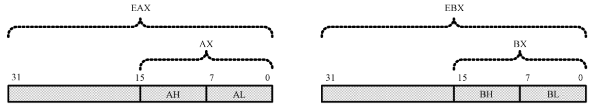
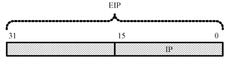
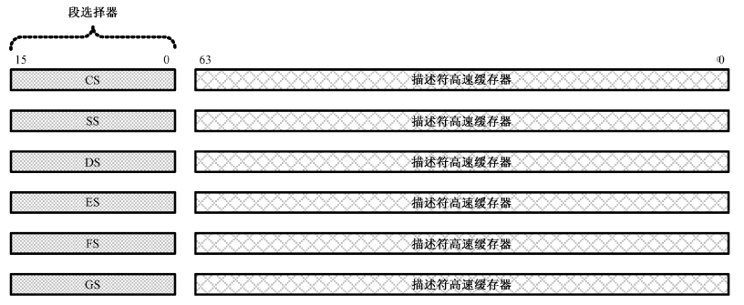
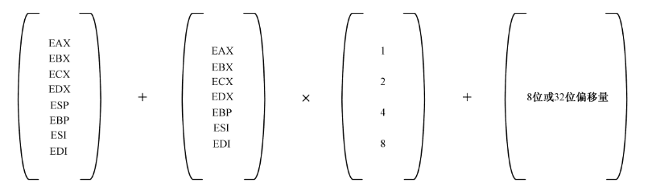

# 10 32位Intel微处理器编程架构

现代的处理器至少都有32根地址线和32根数据线。

## 10.1 IA32架构的基本执行环境

IA32处理器，Intel32位处理器，基于8086发展起来的。

为保持向下兼容，IA32扩展了16位8086的8个通用寄存器。



这些经过扩展的寄存器，分别被命名为：EAX，EBX，ECX，EDX，ESI，EDI，ESP和EBP。和16位的汇编的类似，源操作数和目的操作数的位数要保持相同，并且低16位的寄存器可以单独访问，但高16位不能单独访问：

```masm
mov eax,0x0000ffaa
mov eax,ebx
mov ecx,cx    !不合法
mov ax,bx     !直接访问低16位寄存器
```

IA32处理器引入了自己的32位工作模式--32位保护模式。在这种模式下，处理可以使用他全部的32根地址线，能直接访问4GB的内存。

为生成32为的物理地址，IA32处理器使用了32位的指令执政寄存器--EIP，是对16位模式下IP寄存器的扩展。



虽然IA32处理器的地址线和数据线都为32，理论上不再需要内存分段。但是，IA32处理器仍然采用了以段位段位访问内存的形式，按段分配，不同的程序访问不同的内存段，根本上保护了CPU保护模式下的各个不相关的代码。

在32位保护模式下，每个程序都有自己的内存空间。处理器要求在加载程序时，先定义该程序所拥有的段，然后允许使用这些段。定义这些段时，要附加上段的界限/特权等级/类型等等。当程序在访问一个段时，处理器会在硬件上就进行各种检查工作，避免内存的违规访问。



如上图所示，在32位模式下，传统的段寄存器：CS/DS/SS/ES，保存的不再是段基地址，而是选择要访问的段，因此称为段选择子（段选择器）。每个段选择器还包括一个64位的不可见部分，称为描述符高速缓冲器，里面有段的基地址和各种访问属性，程序不可见，有处理器自动处理。

## 10.2 32位模式的指令系统

在16位实模式下，内存的寻址操作可以由段基址+段变址+偏移量，计算处实际的有效地址：`mov ax,[bx+si+0x02]`。

32位模式下，兼容16位处理器的工作模式，但也有独立且类似的32位运行模式。



在32位模式下，默认使用32位宽度的寄存器，如：`mov eax,ebx`。如果指令中使用了立即数，那么立即数也是默认32位的：`mov ecx,0x55 ;ecx=0x00000055`。如果指令中的操作数指向内存单元，那么，该默认地址也是默认32位：`mov edx,[mem] ;mem是一个32位的段内偏移地址`。
