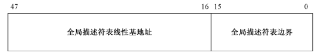
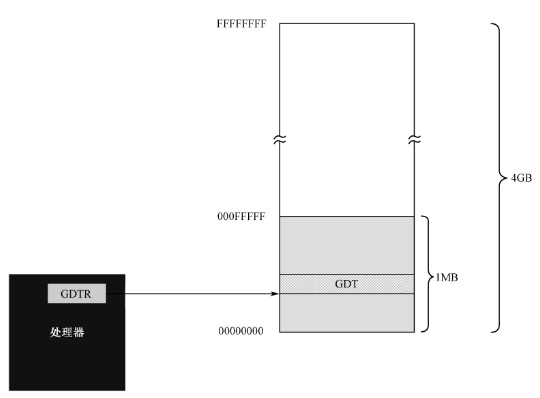
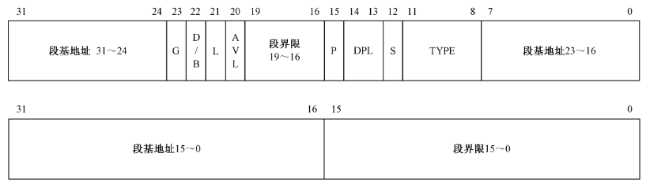
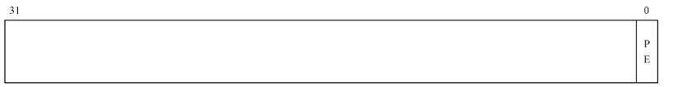
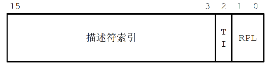
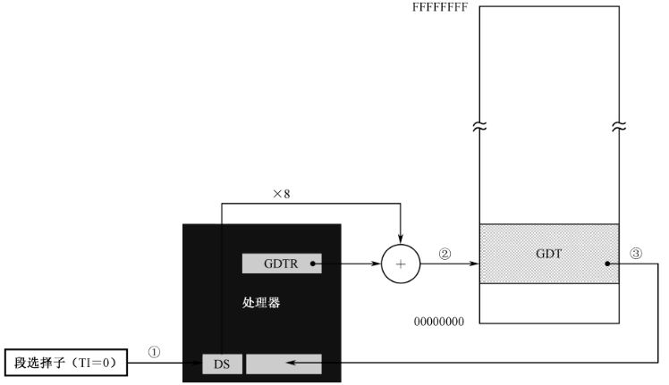

# 11 进入保护模式

实模式下，用户程序对内存访问非常自由，没有任何限制，随便修改任何内存地址。比如：我可以修改正在运行的游戏程序，提高角色攻击力，达到一刀99999的效果...

因此，使用保护模式是非常有必要的。

## 11.1 全局描述符表

为了保证程序在内存中能够自由的浮动，又不影响它的正常执行，处理器将内存划分为逻辑上的段。在保护模式下，对内存的访问仍然延续了段地址+偏移的方式。

但是，在能够对每个段的访问之前，必须进行“登记”。类比开公司，到工商局登记住址，经营范围（段地址/段界限/访问权限等等）。当程序访问超过“所登记”地址活界限时，处理器会阻止该访问行为，产生内部异常中段。

以上所诉的“登记信息”，在保护模式下，需要8个字节来描述，称为“段描述符”，每个段都需要一个描述符。为了存放这些描述符，实模式下在内存中开辟了一段空间，所有的描述符都挨在一起，集中存放，构成一张描述表--全局描述表（GDT，Global Descripter Table）。

在进入保护模式时，必须先定义好全局描述（GDT）表。

为了记录GDT表在内存空间中的位置，处理器内部维护了一个48位的寄存器。如下图所示，包含32位基地址和16位地址边界。因此，GDT表可以保存在任意的内存位置，表的大小最大为：`65536/8=8192`。





但是，由于实模式进入保护模式时，就必须要定义好GDT表，而在实模式在只能访问1MB的内存空间，故GDT表一般定义在1MB内存以下。

## 11.2 存储器的段描述符

GDT表中的每个表项占8个字节，每个比特位含义如下图所示。



- 32位的段基址：在没有开启页功能的情况下，32位的段基址就是逻辑地址（而非16位模式下的左移4+偏移量），因此可以访问到0～4GB地址范围内的任意数据。
  
- 20位段界限：用来限制段的扩展范围/对于向上生长的内存访问，20位段界限限制了最大的偏移量。对于向下生长的栈段，段界限决定了偏移量的最小值。

- G位：用于解释段界限的含义。当G位0时，段界限以字节位单位，最大访问范围2^20=1MB。当G为1时，段界限的单位为4KB，最大访问范围：4KB*2^20=4GB。

- S位：指定描述符的类型，0为系统段，1为代码段or数据段。

- DPL位：表示描述符的特权等级。共有4种0～3，0是最高的特权等级，3最低。

- P位：段存在位，表示对应的内存段是否存在于内存中。当内存资源紧张时，会把很少使用的内存段swap到磁盘中，并将P位清零（虚拟内存的调度）。

- D/B位：默认的操作数（指针）大小，清零表示16位，置1表示32位。主要是用来32位兼容运行16位保护模式的程序。

- L位：64位代码标识位，保留给64位处理器使用。

- AVL位：软件使用位，一般给操作系统使用。

- TYPE字段：共4位，表示描述的类型。类型有点多，具体含义，遇到再说吧...

## 11.3 安装并加载GDTR

```masm
;设置堆栈段和栈指针 
         mov ax,cs      
         mov ss,ax
         mov sp,0x7c00
      
         ;计算GDT所在的逻辑段地址 
         mov ax,[cs:gdt_base+0x7c00]        ;低16位 
         mov dx,[cs:gdt_base+0x7c00+0x02]   ;高16位 
         mov bx,16        
         div bx            
         mov ds,ax                          ;令DS指向该段以进行操作
         mov bx,dx                          ;段内起始偏移地址 
      
         ;创建0#描述符，它是空描述符，这是处理器的要求
         mov dword [bx+0x00],0x00
         mov dword [bx+0x04],0x00  

         ;创建#1描述符，保护模式下的代码段描述符
         mov dword [bx+0x08],0x7c0001ff     
         mov dword [bx+0x0c],0x00409800     

         ;创建#2描述符，保护模式下的数据段描述符（文本模式下的显示缓冲区） 
         mov dword [bx+0x10],0x8000ffff     
         mov dword [bx+0x14],0x0040920b     

         ;创建#3描述符，保护模式下的堆栈段描述符
         mov dword [bx+0x18],0x00007a00
         mov dword [bx+0x1c],0x00409600

         ;初始化描述符表寄存器GDTR
         mov word [cs:gdt_size+0x7c00],31  ;描述符表的界限（总字节数减一）   
                                             
         lgdt [cs:gdt_size+0x7c00]
      
         ;先取出0x92端口的数据
         in al,0x92                         ;南桥芯片内的端口 
         ;与0000_0010B进行或操作用于打开A20
         or al,0000_0010B
         ;再将新的数据写回0x92端口
         out 0x92,al                        ;打开A20

         cli                                ;保护模式下中断机制尚未建立，应 
                                            ;禁止中断 

         mov eax,cr0                        ;取出cr0寄存器
         or eax,1                           ;设置PE位
         mov cr0,eax                        ;写回cr0寄存器
      
         ;以下进入保护模式... ...
         ;此时已经在保护模式中，所以下面的代码中的0x008已经不像在
         ;实模式下那样是段偏移量了，而是段选择子
         jmp dword 0x0008:flush             ;16位的描述符选择子：32位偏移
                                            ;清流水线并串行化处理器 
         [bits 32] 

    flush:
         mov cx,00000000000_10_000B         ;加载数据段选择子(0x10)
         mov ds,cx

         ;以下在屏幕上显示"Protect mode OK." 
         mov byte [0x00],'P'  
         mov byte [0x02],'r'
         mov byte [0x04],'o'
         mov byte [0x06],'t'
         mov byte [0x08],'e'
         mov byte [0x0a],'c'
         mov byte [0x0c],'t'
         mov byte [0x0e],' '
         mov byte [0x10],'m'
         mov byte [0x12],'o'
         mov byte [0x14],'d'
         mov byte [0x16],'e'
         mov byte [0x18],' '
         mov byte [0x1a],'O'
         mov byte [0x1c],'K'

         ;以下用简单的示例来帮助阐述32位保护模式下的堆栈操作 
         mov cx,00000000000_11_000B         ;加载堆栈段选择子
         mov ss,cx
         mov esp,0x7c00

         mov ebp,esp                        ;保存堆栈指针 
         push byte '.'                      ;压入立即数（字节）
         
         sub ebp,4
         cmp ebp,esp                        ;判断压入立即数时，ESP是否减4 
         jnz ghalt                          
         pop eax
         mov [0x1e],al                      ;显示句点 
      
  ghalt:     
         hlt                                ;已经禁止中断，将不会被唤醒 

;-------------------------------------------------------------------------------
     
         gdt_size         dw 0
         gdt_base         dd 0x00007e00     ;GDT的物理地址 
                             
         times 510-($-$$) db 0
                          db 0x55,0xaa

```

## 11.4 保护模式下的内存访问

进入保护模式的开关是在处理器内部的CR0寄存器，如下图所示，它的第一位是保护模式允许位（Protection Enable，PE）。



如下代码，即为进入保护模式。

```masm
    mov eax,cr0                        ;取出cr0寄存器
    or eax,1                           ;设置PE位
    mov cr0,eax                        ;写回cr0寄存器
```

进入保护模式后，原有的中断向量表不在适用，内存访问方式也发生了变化。

在实模式下，访问内存使用的是逻辑地址，将段地址乘以16，再加上偏移地址。

在保护模式下，6个段寄存器将作为段选择子使用。如图所示，督办选择子包含三个部分：



- 描述符索引，描述符表中的第n个表项了；

- TI=0，表描述符在GDT中；TI=1，表描述符在LDT中；

- RPL，访问者的特权等级。

在11.3节中代码，访问内存代码如下所示。

```masm
    mov cx,00000000000_10_000B         ;加载数据段选择子(0x10)
    mov ds,cx
```

代码`mov cx,00000000000_10_000B`中，段基地址位0b0000000000010_0_00，描述符索引为2，TI=0表示访问GDT表，访问者特权等级为0。表示目前选择的内存段是，此前在注册GDT表中写入的数据段。

选中数据段后，进行内存访问时：`mov byte [0x00],'P'`，其过程如下：

(1) 加载GDT表表项，到段描述符高速缓冲器；



（2）根据32位基地址和段内偏移访问内存。
