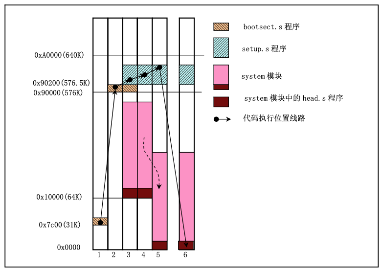

# 1 引导操作系统启动

本章主要学习linux 0.11源码，boot/目录下的三个汇编代码。

bootsect.s和setup.s是运行在16位的实模式，head.s是运行在32位的保护模式。

系统启动时，执行的程序顺序如下：


## 1.1 总体流程

Linux操作系统上电启动时，80x86结构的CPU将自动进入实模式，并且从0xFFFF0（这个地址一般写死在BIOS ROM中）处开始自动执行代码。

这个地址开始执行的是系统的BIOS代码，进行某些系统检查，并且在物理地址0处开始初始化中断向量。

此后，他将启动设备的第一个扇区（引导扇区，512B）读入内存0x7C00处，并且跳转到这个地方开始执行。这个地方的代码就是boot/bootsect.s代码，使用的是8086汇编语言。本部分程序会将自己从内存地址0x7C00处移动到0x9000处，并从启动设备上读入后续2KB的代码(boot/setup.s)，到内存0x90200处。

bootsect.s程序中，会将内核的system模块读入到0x1000处，因为当时的system模块(head.s，main.c)不会超过0x80000字节大小。

head.s中，会完成进行实模式的相关设置，并进入实模式。最终执行init/main.c中的main程序。

这样子一顿操作之后，内核代码在内存位置中的移动如下：


bootsect.s 代码及注释如下：

```masm
!
! SYS_SIZE is the number of clicks (16 bytes) to be loaded.
! 0x3000 is 0x30000 bytes = 196kB, more than enough for current
! versions of linux
! 系统模块长度，单位：节，1节=16字节
SYSSIZE = 0x3000
!
! bootsect.s  (C) 1991 Linus Torvalds
!
! bootsect.s is loaded at 0x7c00 by the bios-startup routines, and moves
! iself out of the way to address 0x90000, and jumps there.
!
! It then loads 'setup' directly after itself (0x90200), and the system
! at 0x10000, using BIOS interrupts. 
!
! 使用BIOS将 setup 和 system 模块都加载到内存
!
! NOTE! currently system is at most 8*65536 bytes long. This should be no
! problem, even in the future. I want to keep it simple. This 512 kB
! kernel size should be enough, especially as this doesn't contain the
! buffer cache as in minix
!
! The loader has been made as simple as possible, and continuos
! read errors will result in a unbreakable loop. Reboot by hand. It
! loads pretty fast by getting whole sectors at a time whenever possible.
!
! 为了快速启动，，把加载程序设计的十分简单

! global 声明变量是外部 or 全局的
.globl begtext, begdata, begbss, endtext, enddata, endbss

! 定义代码段，数据段，未初始化数据段
.text
begtext:
.data
begdata:
.bss
begbss:
.text

SETUPLEN = 4    ! nr of setup-sectors。setup扇区数量
BOOTSEG  = 0x07c0   ! original address of boot-sector
INITSEG  = 0x9000   ! we move boot here - out of the way
SETUPSEG = 0x9020   ! setup starts here
SYSSEG   = 0x1000   ! system loaded at 0x10000 (65536).
ENDSEG   = SYSSEG + SYSSIZE  ! where to stop loading

! 指定根文件系统设备，0x306 表示从第2个硬盘的第1个分区开始读系统文件。
! 命名规则：1内存，2磁盘，3硬盘，4ttyx，5tty，6并行口，7非命名管道
! 0x300: /dev/hd0 代表整个第一个硬盘，硬盘共有4个分区；则0x301～0x304表示第一个盘的1～4个分区
! 0x305: /dev/hd5 代表整个第二个硬盘，硬盘共有4个分区；则0x306～0x309表示第二个盘的1～4个分区
! ...依此类推...
! ROOT_DEV: 0x000 - same type of floppy as boot.
!  0x301 - first partition on first drive etc
ROOT_DEV = 0x306 ! 0x306 表示从第2个硬盘的第1个分区开始读系统文件

entry _start
_start:
    ! 系统的第一个扇区，是由bios读入到0x07c0处，并从此处开始执行
 ! bootsect代码从内存地址 0x07c0，移动到 0x9000
 ! 这样子操作，是为了给system模块腾出空间
 mov ax,#BOOTSEG
 mov ds,ax         !ds=0x07c0
 mov ax,#INITSEG
 mov es,ax         !es=0x9000
 mov cx,#256
 sub si,si
 sub di,di
 rep               
 movw              ! 移动1个字,重复256次，就等于1个扇区的长度 

 jmpi go,INITSEG   ! 段间跳转指令，cs=INITSEG，ip=go

go: mov ax,cs
 mov ds,ax
 mov es,ax
! put stack at 0x9ff00.
! 分配栈空间ss=0x9000，sp=ff00，向下生长
 mov ss,ax
 mov sp,#0xFF00  ! arbitrary value >>512

! load the setup-sectors directly after the bootblock.
! Note that 'es' is already set up.

! load_setup利用BIOS 0x13号中断，读取setup模块，存放到 0x90200 内存地址处
! BIOS INT 13H 中断，02功能码使用：
! 功能描述：读扇区
! 入口参数：AH＝02H
! AL＝扇区数, CH＝柱面（磁道）, CL＝扇区, DH＝磁头（盘面）
! DL＝驱动器，00H~7FH：软盘；80H~0FFH：硬盘
! ES:BX＝缓冲区的地址
! 出口参数：CF＝0——操作成功，AH＝00H，AL＝传输的扇区数，否则，AH＝状态代码，参见功能号01H中的说明
load_setup:
 mov dx,#0x0000  ! drive 0, head 0              ! dl=0：软盘，dh=0：0号磁头
 mov cx,#0x0002  ! sector 2, track 0            ! cl=2：2号扇区，ch=0：0号柱面
 mov bx,#0x0200  ! address = 512, in INITSEG    ! es之前已经被写入为0x9000，因此读入的内存缓冲区地址为：0x90200
 mov ax,#0x0200+SETUPLEN ! service 2, nr of sectors ! AH=2：读扇区，AH=SETUPLEN=4：读取入4个扇区
 int 0x13   ! read it
 jnc ok_load_setup  ! ok - continue
 mov dx,#0x0000
 mov ax,#0x0000  ! reset the diskette
 int 0x13
 j load_setup      ! 出现加载失败的话，会死循环，直到加载成功

ok_load_setup:

! Get disk drive parameters, specifically nr of sectors/track
! BIOS INT 13H 中断，08功能码使用：
! 功能描述：读取驱动器参数
! 入口参数：AH＝08H，DL＝驱动器，00H7FH：软盘；80H0FFH：硬盘
! 出口参数：CF＝1——操作失败，AH＝状态代码，参见功能号01H中的说明，否则， BL＝01H — 360K,＝02H — 1.2M,＝03H — 720K,＝04H — 1.44M
! CH＝柱面数的低8位,CL的位7-6＝柱面数的高2位,CL的位5-0＝扇区数
! DH＝磁头数,DL＝驱动器数，ES:DI＝磁盘驱动器参数表地址

 mov dl,#0x00        ! 读取软盘参数信息
 mov ax,#0x0800  ! AH=8 is get drive parameters
 int 0x13
 mov ch,#0x00
 seg cs
 mov sectors,cx      ! 保存每条磁道的 扇区数 到 cs:sectors 处
 mov ax,#INITSEG
 mov es,ax

! Print some inane message
! INT 10 功能03H
! 功能描述：在文本坐标下，读取光标各种信息
! 入口参数：AH＝03H,BH＝显示页码
! 出口参数：CH＝光标的起始行,CL＝光标的终止行,DH＝行(Y坐标),DL＝列(X坐标)

 mov ah,#0x03  ! read cursor pos，读取光标位置
 xor bh,bh
 int 0x10

 ! INT 10 功能0x13H, 在Teletype模式下显示字符串
    ! 入口参数：AH＝13H
    ! BH＝页码,BL＝属性(若AL=00H或01H),CX＝显示字符串长度,(DH、DL)＝坐标(行、列)
    ! ES:BP＝显示字符串的地址
    ! AL＝显示输出方式
    ! 0——字符串中只含显示字符，其显示属性在BL中。显示后，光标位置不变
    ! 1——字符串中只含显示字符，其显示属性在BL中。显示后，光标位置改变
    ! 2——字符串中含显示字符和显示属性。显示后，光标位置不变
    ! 3——字符串中含显示字符和显示属性。显示后，光标位置改变

 mov cx,#24
 mov bx,#0x0007  ! page 0, attribute 7 (normal)
 mov bp,#msg1        ! es=INITSEG=0x9000=cs，就是当前代码段
 mov ax,#0x1301  ! write string, move cursor，ah=0x13h，al=0x01h
 int 0x10

! ok, we've written the message, now
! we want to load the system (at 0x10000)
! 开始加载system模块

 mov ax,#SYSSEG
 mov es,ax  ! segment of 0x010000，es=0x1000
 call read_it ! 读取system模块到 0x010000
 call kill_motor ! 关闭软盘驱动器

! After that we check which root-device to use. If the device is
! defined (!= 0), nothing is done and the given device is used.
! Otherwise, either /dev/PS0 (2,28) or /dev/at0 (2,8), depending
! on the number of sectors that the BIOS reports currently.

 seg cs
 mov ax,root_dev     ! 判断是否使用根文件系统设备，非0表示已经指定，否则使用BIOS指定的默认值：/dev/PS0(2,28)或者/dev/at0(2,8)
 cmp ax,#0
 jne root_defined
 seg cs
 mov bx,sectors
 mov ax,#0x0208  ! /dev/ps0 - 1.2Mb
 cmp bx,#15          ！检查每条磁道的扇区数是否等于15
 je root_defined
 mov ax,#0x021c  ! /dev/PS0 - 1.44Mb
 cmp bx,#18
 je root_defined
undef_root:
 jmp undef_root
root_defined:
 seg cs
 mov root_dev,ax      ! 保存根文件系统的设备号，以后加载文件系统要用

! after that (everyting loaded), we jump to
! the setup-routine loaded directly after
! the bootblock:

 jmpi 0,SETUPSEG    ! 跳转到set up模块执行

! This routine loads the system at address 0x10000, making sure
! no 64kB boundaries are crossed. We try to load it as fast as
! possible, loading whole tracks whenever we can.
!
! in: es - starting address segment (normally 0x1000)
!

! 当前已入的扇区数：1个boot扇区+4个setup扇区
sread: .word 1+SETUPLEN ! 扇区 sectors read of current track
head: .word 0   ! 磁头 current head
track: .word 0   ! 磁道 current track

read_it:
 mov ax,es
 test ax,#0x0fff
 ! 入参es的值必须为64KB的边界值，否则进入死循环
die: jne die   ! es must be at 64kB boundary
 xor bx,bx  ! bx is starting address within segment
rp_read:
 mov ax,es
 ! 是否所有system扇区，都已经读入内存
 cmp ax,#ENDSEG  ! have we loaded all yet? ENDSEG = SYSSEG + SYSSIZE；
 jb ok1_read         ! JB 无符号比较，小于则跳转
 ret

! 依次读入每个磁道的数据
ok1_read:
 seg cs
 mov ax,sectors      ! 读取每条磁道的扇区数
 sub ax,sread        ! ax = ax-减去当前磁道已读的扇区数 = 当前磁道未读扇区数
 mov cx,ax           ! cx = ax = 当前磁道未读扇区数 = 总扇区数 - 已读扇区数
 shl cx,#9           ! cx=未读扇区数*512字节，表示即将要读取这么多数据
 add cx,bx           ! cx+bx(当前段内偏移),试试看当前数据段，能不能存下这么多数据
 jnc ok2_read        ! JNC; 不进位则跳转，不进位表示当前数据段能存下这么多数据
 je ok2_read
 xor ax,ax           ! ax=0，不使用mov ax，0的原因是 xor指令占用内存空间更小
 sub ax,bx           ! ax=0-bx 表示 bx的补码，当前段只能存下这么多数据
 shr ax,#9           ！ax/512 表示当前段只能容得下 这么多个扇区的数据
ok2_read:
    ! 入参al表示要读入多少个扇区
 call read_track
 mov cx,ax           !ax=当前操作读入多少个扇区
 add ax,sread        !ax = 当前磁道共读取了多少个扇区
 seg cs
 cmp ax,sectors      !判断当前磁道的所有扇区，是不是全部读完了
 jne ok3_read        !当前磁道还有没读完的扇区，就跳转到ok3_read，继续读

 ! 3.5寸1.44M 软盘，有两个磁头，正反两面各一个；80个磁道（即80个圆圈）；每个磁道有18个扇区；每个扇区为512字节。
    ! 软盘容量 = 512字节/扇区 * 2面 * 80磁道（柱面）/面 * 18扇区/磁道 = 1440 KB
    ! 磁头，即面：编号[0, 1]
    ! 80个磁道，即柱面（圆圈）：编号[0, 79]
    ! 18个扇区：编号[1, 18]
    ! 相对扇区号[0, 2879]：相对扇区号按照柱面排序，即从最外头的圆圈到最里头的圆圈。
    ! 0柱面正面（即磁头号为0）的1-18扇区为0-17号相对扇区，0柱面反面（即磁头号为2）的1-18扇区为18-35号相对扇区，然后是1柱面，2柱面，直到79柱面。
 mov ax,#1
 sub ax,head         !正面读完读反面,反面读完又回到正面，并且吧track+1
 jne ok4_read        !如果当前在0磁头，就跳转到ok4_read，去读取1磁头的数据
 inc track           !
ok4_read:
 mov head,ax
 xor ax,ax           !从1磁头开始读取数据，并且清空已读的扇区数
ok3_read:
 mov sread,ax
 shl cx,#9
 add bx,cx
 jnc rp_read
 mov ax,es
 add ax,#0x1000
 mov es,ax
 xor bx,bx
 jmp rp_read

read_track:
 push ax
 push bx
 push cx
 push dx
 mov dx,track   !读取当前磁道号
 mov cx,sread   !cx=strad+1,开始读取扇区的位置
 inc cx
 mov ch,dl      !ch=dl=当前磁道号
 mov dx,head    !读取当前磁头号（在哪个盘面读）
 mov dh,dl      !dh磁头
 mov dl,#0      !驱动器号
 and dx,#0x0100
 mov ah,#2
 int 0x13
 jc bad_rt
 pop dx
 pop cx
 pop bx
 pop ax
 ret
bad_rt: mov ax,#0
 mov dx,#0
 int 0x13
 pop dx
 pop cx
 pop bx
 pop ax
 jmp read_track

!/*
! * This procedure turns off the floppy drive motor, so
! * that we enter the kernel in a known state, and
! * don't have to worry about it later.
! */
kill_motor:
 push dx
 mov dx,#0x3f2
 mov al,#0
 outb
 pop dx
 ret

sectors:
 .word 0

msg1:
 .byte 13,10
 .ascii "Loading system ..."
 .byte 13,10,13,10

.org 508
root_dev:
 .word ROOT_DEV
boot_flag:
 .word 0xAA55

.text
endtext:
.data
enddata:
.bss
endbss:

```
