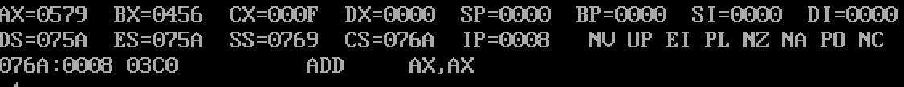
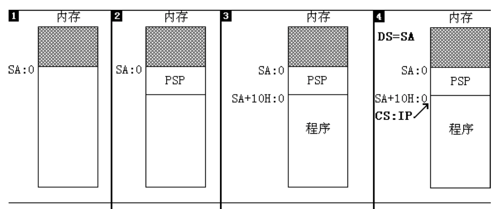

# 第一个程序

在此之前，都是通过debug的方式，写入一条条指令，单步执行，本章，将会开始完整的汇编语言程序，然后编译连接为可执行程序。

## 4.1 程序执行过程

1. 写代码；

2. 对源程序进行编译连接：编译产生目标文件，再用连接器对目标文件进行连接，生成可执行文件。可执行文件中包含两部分：机器码指令/源程序中定义的数据和可执行文件的元信息。

3. 执行可执行文件。

## 4.2 程序示例

先上一段代码。

```masm
assume cs:codesg  #cs = codesg

codesg segment
    mov ax,0123H
    mov bx,0456H
    add ax,bx
    add ax,ax

    mov ax,4c00H
    int 21H

codesg ends

end
```

1. assume伪指令，假设段寄存器和程序中的某一个段的定义相关联，如例子中的 `assume cs:codesg` 表示将代码段codesg与cs段寄存器相关联，有“cs=codesg”的含义。

2. xxx segment ... xxx ends伪指令，定义一个段，如代码段，数据段或者栈空间。xxx表示该段的标号，指代该段的地址。

3. end汇编结束标记，注意不要与ends混淆。

4. 程序返回`mov ax,4c00H int 21H`,先记着这么用，后面会学到。

4.3 编译，连接和执行

dosbox下，edit进行编辑源程序，输出ASM文件；

`masm c:\4_3.ASM`进行编译源程序文件，输出OBJ文件；

`link 4_3.OBJ`进行连接，输出EXE文件；

`4_3`由shell执行程序，也可以使用`debug 4_3`debug执行。

## 4.4 程序在dos系统中的加载过程

程序在dos系统中的加载过程，如图所示：




1. 找到一段起始地址为075AH(DS寄存器)的空闲区域（容量足够大）；

2. 将段DS=075AH开始的256个字节开始的内存区域作为PSP程序段前缀，DOS要利用这个区域和被加载程序进行通信。

3. 紧接着PSP（段地址076AH）就是程序段，将程序加载到该内存空间；

4. 设置CS:IP指向程序入口。
