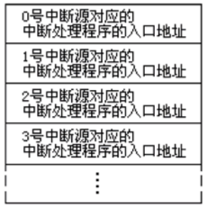

# 12 内中断

CPU在执行完成当前指令后，会检测从外部或者内部产生的特殊信号，并且在接收到的信号进行特殊的处理，这个台“特殊”的信息就是：中断。

中断可根据来自CPU的内部和外部，分为内中断和外中断。本章主要学习内中断。

## 12.1 内中断的产生

8086CPU产生中断的途径有：

- 除法溢出，中断类型码为0

- 单步执行，中断类型码为1

- 执行into指令，中断类型码为4

- 执行int指令，中断类型码为n，对应`int n`1中给出的立即数n。

在CPU内部，对于不同产生途径的中断源，使用“中断类型码”来区分。中断类型码占一个字节，即能够表示256种类型。

## 12.2 中断向量表

在8086CPU中，指定在内存地址0处存放**中断向量表**。在中断向量表中，保存着256个“中断类型码”对应的处理程序。

每个中断向量表的表项占两个字，高地址代表CS，低地址代表IP，即从内存0000:0000~0000:03FF存放中断向量表。

## 12.3 中断过程

CPU收到中断信息后，**由CPU的硬件完成**对中断信息进行处理，引发“中断过程”：

(1)从中断信息中取得中断类型码；
(2)标志寄存器的值入栈，pushf；
(3)设置标志寄存器的值，TF=0，IF=0（后续学习）；
(4)CS的值入栈，push cs；
(5)IP的值入栈，push ip；
(6)获取中断向量表表项，设置CS和IP：(IP)=(N*4),(CS)=(N*4+2)；
(7)执行中断程序。

编写中断处理程序和子程序比较相似：
(1)保存中断程序使用到的寄存器；
(2)处理中断；
(3)恢复使用到的寄存器
(4)使用`iret`返回

指令`iret`是与硬件自动执行中断过程配合完成的。硬件执行中断过程时，执行的顺序是将标志寄存器、CS、IP入栈，保存中断现场。`iret`指令则是IP、CS、标志寄存器出栈，恢复中断现场。
