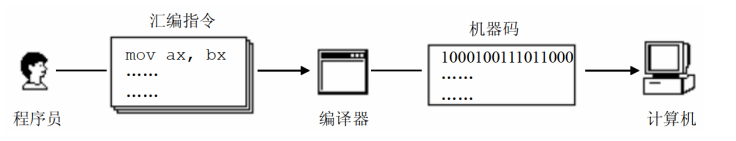

# 1基础知识

## 1.1汇编的产生

早起使用机器码类似 010101011 表示一个指令的方式，难于辨识和记忆，于是产生了汇编。例如，使用`mov ax,bx`表示机器码`1000100111011000` ，这种写法与人类语言更为接近。

```assembly
mov ax,bx        #汇编
1000100111011000 #机器指令
```

但是，计算机却只能读懂机器指令。因此，需要将汇编指令翻译为机器码，拥有这一功能的软件就是我们日常所说的编译器。


## 1.2 汇编的组成

汇编语言发展至今，共有三类指令：

(1) 汇编指令：机器吗的助记符，有对应的机器码；

(2)伪指令：没有对应的机器码，由编译器执行，计算机变为执行；

(3)其他富豪：如+-*/，由编译器识别，没有对应的机器码。

## 1.3 一条指令的执行过程

见计算机组成原理部分读书笔记，cpu部分

放张图，回忆一下


## 1.4 内存地址空间

见计算机组成原理部分读书笔记，内存io部分
