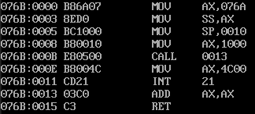

# 10 call和ret指令

子程序设计基础，call和ret。

## 10.1 ret和retf

ret指令，使用栈中的数据，修改IP的内容，实现近转移；指令执行后：

`(ip)=((ss)*16+(sp))`

`(sp)=(sp)+2`。

相当于

`pop ip`。

retf指令，使用栈中的数据，修改CS和IP的内容，实现远转移；指令执行后：

`(ip)=((ss)*16+(sp))`，

`(sp)=(sp)+2`，

`(cs)=((ss)*16+(sp))`，

`(sp)=(sp)+2`，

相当于

`pop ip`

`pop cs`。

下面这个case，执行后，(cs)=code,(ip)=0：

```masm
assume cs:code,ss:stack

stack segment
    db 16 dup(0)
stack ends

code segment
    mov ax,4c00h
    int 21h

start:mov ax,stack
      mov ss,ax
      mov sp,16

      mov ax,0
      push ax  ;push ip
      mov bx,0
      ret
      /* 
      或者是：
      mov ax,code
      push ax  ;push cs
      mov ax,0 ;push ip  
      push ax
      mov bx,0
      retf
      */
code ends
```

## 10.2 call指令

CPU执行CALL指令时，进行两步操作：

1. 将当前的ip or cs+ip入栈；

2. 转移。

call指令不能实现短转移，其实现方法和jmp的原理相同。

call指令语法规则类似jmp指令：

|call指令|解释|等同指令|
| ---- | ---- | ---- |
|call 标号|根据标号进行跳转|push ip，jmp 标号|
|call far ptr 标号|根据目的地址进行跳转|push cs，push ip，jmp far ptr 标号|
|call reg|根据寄存器中的地址进行跳转|push ip，jmp reg|
|call word ptr 地址|根据寄内存单元中的地址进行跳转|push ip，jmp word ptr 地址|
|call dword ptr 地址|根据寄内存单元中的地址进行跳转|push cs，push ip，jmp dword ptr 地址|

## 10.3 call与ret结合使用

使用call和ret指令，来实现子程序机制。

```masm
assume cs:codesg

stack segment
  db 8 dup(0)
  db 8 dup(0)
stack ends

codesg segment
  main:mov ax,stack
        mov ss,ax
        mov sp,10h
        mov ax,1000h
        call s1
        mov ax,4c00h
        int 21h
     s1:add ax,ax
        ret
codesg ends

main start

```

debug运行后，代码地址和机器码如下：



执行call 指令后，((stack)*16+sp)=0EH。

## 10.3 子程序的参数传递

子程序一般使用寄存器传递参数，在寄存器不够用的情况下，使用内存地址传递。

但是，使用寄存器传递子程序参数，容易使得主程序与子程序的寄存器使用发生冲突。因此。一般在进入子程序时，将子程序内使用的寄存器入栈，返回前，将相关寄存器出栈。

经典模版：

```masm
标号: push 使用到的寄存器
     一堆子程序逻辑操作...
     pop 使用到的寄存器
     ret
```

注意入栈和出栈的顺序。
