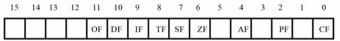
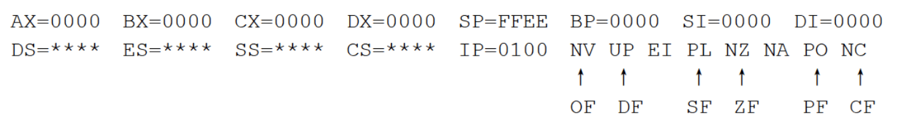

# 11 标志寄存器

8086CPU内部有一个特殊的寄存器--标志寄存器，又称为flag寄存器，具有以下功能：

- 存储某些指令的执行结果；

- 为CPU执行相关指令提供依据；

- 控制相关CPU的工作。

标志寄存器的每一位都有特殊的含义：



**影响标志寄存器的指令，大都是运算指令，比如：add，sub，mul，div，inc，and，or。而传送指令mov，push，pop大都对ZF没有影响。**

## 11.1 寄存器各比特位含义

### ZF标志--零标志位

flag的第6位--ZF，零标志位：用于记录相关指令执行后，结果位0，则ZF=1，否则ZF=0。例如：

```masm
mov ax,0     ;ZF=0
or ax,1      ;ZF=1
```

### PF标志--奇偶标志位

flag的第二位是PF，奇偶标志位，记录相关指令执行后，bit位中所有1的个数是否为偶数。例如：

```masm
mov ax,0     ;PF=0，mov不影响标志为
or ax,1      ;PF=0，00000001中1的个数位1，PF=0
or ax,2      ;PF=1，00000011中1的个数位2，PF=1 
```

### SF标志--符号标志位

flag的第七位，符号标志位，记录相关指令执行后，结果是否为负。例如：

```masm
mov ax, 10000001B
and ax, 1           ;ax=-127<0，SF=1
```

### CF进位标志位

flag的第0位，进位标志位。在**无符号数运算**中，加法时，记录**最有效高位**是否产生进位；减法时，记录**最有效高位**是否产生借位。例如：

```masm
mov al,10000001B
add al,al          ;al=00000010，最高位进位，CF=1
```

### OF溢出标志位

在进行**有符号数运算**相关指令的运算结果，超过了当前寄存器的最大表示范围，将产生溢出，OF=1。例如：

```masm
mov al,99
add al,al     ; al > 128, OF=1
```

注意OF和CF的使用场景分别是：有符号和无符号运算，只有在特定场景下，才有意义。例如上面指令执行后，OF=1，CF=0。在有符号的场景下，al=198>128产生溢出，OF=1；在无符号的场景下，al=198<256，最高位未发生进位，CF=0。

### DF方向标志位

flag的第10位是方向标志位。在串处理指令中，每次操作后，控制si，di的增加or减少。

- DF=0，每次操作后si/di递增

- DF=1，每次操作后si/di递减

## 11.2 带进位加法指令adc和带错位减法sbb

adc是带进位加法指令，利用CF位上的值进行加法运算。`adc ax,bx`相当于`(ax)=(ax)+(bx)+(CF)`。

sbb是带错位减法指令，利用CF位上的值进行减法法运算。`sbb ax,bx`相当于`(ax)=(ax)-(bx)-(CF)`。

使用adc指令的意义是，完成更多位数的加减法。例如。使用下面指令实现128位的加法：

```masm
add128: push ax
        push cx
        push si
        push di

        sub ax,ax    ;清空CF

      s:mov ax,ds:[si]
        adc ax,ds:[di]
        mov ds:[di],ax
        add si,2
        add di,2
        loop s

        pop di
        pop si
        pop cx
        pop ax
        ret
```

## 11.3 cmp比较指令

cmp指令相当于减法指令，只是不保存结果，只影响相关标志寄存器。

例如，`cmp ax,ax`，相当于执行`sub ax,ax`，但不改变ax寄存器的值，结果为：ZF=0，CF=0，OF=0，SF=0，PF=1。

cmp指令的设计思路是，通过减法运算，影响相关寄存器，判断比较结果。

无符号比较时，指令`cmp ax,bx`：

- ZF=1，ax=bx

- ZF=0，ax!=bx

- CF=1，ax < bx

- CF=0，ax >= bx

- CF=0且ZF=0，ax > bx

有符号比较时，指令`cmp ax,bx`：

- ZF=1，ax = bx

- SF=1且OF=0，ax < bx

- SF=1且OF=1，ax > bx（由于溢出，减法结果由正数变负数）

- SF=0且OF=1，ax < bx（由于溢出，减法结果由负数变正数）

- SF=1且OF=0，ax >= bx

## 11.4 条件转移指令

条件转移指令指的是，检测某个寄存器的值，当满足一定条件时，修改CS:IP实现指令跳转。例如先前学过的`jcxz xxx`指令，检测CX=0成立，则修改IP。

还有一些指令是根据cmp指令的比较结果，进行跳转的。

|指令|含义|检测标志位|
| ---- | ---- | ---- |
|je|equal，等于则转移|ZF=1|
|jne|not equal，不等于则转移|ZF=0|
|jb|below，小于转移|CF=1|
|jnb|not below，不小于则转移|CF=0|
|ja|above，大于则转移|CF=0且ZF=0|
|jna|not above，不大于则转移|CF=1或者ZF=1|

举例，统计data段中小于8的字节个数，结果用AX保存。

```masm
      mov ax,data
      mov ds,ax
      mov bx,0
      mov cx,8
    s:cmp byte ptr [bx],8
      jnb next
      inc ax
 next:inc bx
      loop s
```

## 11.5 串处理指令

movsb/movsw指令，相当于执行了下面几个步骤：

1. ((es)*16+(di))= ((ds)*16+(si))
2. df=0,则si/di+=1；df=0，则si/di-=1。

设置DF标志位：`cld`将DF设置为0，`std`将DF设置为1。

一般在使用movsb时，会与`rep`指令连用，`rep movsb`/`rep movsw`，其效果等同于：

```masm
    s:movsb
      loop s
```

使用串指令，能够很方便的进行内存复制，例如：

```masm
    mov ax,data  ;源地址：data:0H
    mov ds,ax
    mov si,0

    mov es,1000H ;目的地址：1000:0H
    mov di,0
    mov cx,16
    cld
    rep movsb ;复制16个字节
```

### 11.6 pushf和popf

pushf和popf指令，是对标志寄存器进行入栈和出栈。

### 11.7 实验：字符串转大写

```masm
assume cs:codesg,ds:datasg,ss:stacksg

datasg segment
  db "Black's is BIG,lalala.---Green",0
datasg ends

stacksg segment
  db 128 dup(0)
stacksg ends

codesg segment
    start:mov ax,datasg
          mov ds,ax
          mov ax,stacksg
          mov ss,ax
          mov si,0
          mov sp,0
          call letterc

          mov ax,4c00H
          int 21H
;输入：ds，字符串段地址
;输入：si，字符串偏移地址
;约定输入字符串格式：已0结尾
;输出：在原内存地址上将字母修改为大写
  letterc:push ax
          pushf

          mov ax,0
          push ax
          popf           ;清空标志寄存器

        s1:mov al,ds:[si]
          cmp al,0       ;判断结束符
          je end_let
          cmp al,97      ;'a'=97
          jb next
          cmp al,122     ;'z'=122
          ja next
          and al,11011111B
          mov ds:[si],al
     next:inc si
          jmp short s1
  end_let:popf
          pop ax
          ret
codesg ends

end start

```

debug模式下，查看各个标志位：



各标志位具体含义如下：

|标志|值为1|值为0|
| ---- | ---- | ---- |
|OF|OV|NV|
|SF|NG|PL|
|ZF|ZR|NZ|
|PF|PE|PO|
|CF|CY|NC|
|DF|DN|UP|
