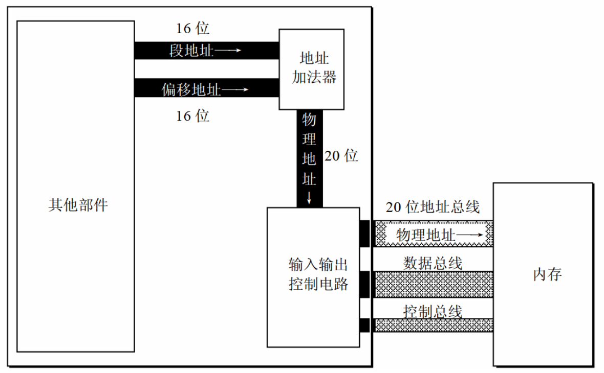

# 2 寄存器

cpu由运算器、控制器和寄存器组成，各个部件组成，可以看上一篇中指令执行过程图。

对于学习汇编来说，主要和寄存器打交道，同学们可以通过改变各种寄存器的内容来实现对cpu的控制。不同的cpu，寄存器的个数以及结构是不同的，比如8086有14个寄存器，如AX，BX，CX，DX，SI，DI，SP等等，每个寄存器都是16位的。

## 2.1 通用寄存器

AX，BX，CX，DX在这四个寄存器通常用来存放一般性的数据，被称为通用寄存器。

这四个16位通用寄存器又课分为两个8位寄存器，如AX分为AH和AL。

图中，AX=0x4E20H,AH=4EH,AL=20H。

出于对兼容性的考虑，8086提供了两种尺寸的数据：

- 字节：byte，8bit组成，可以在8位寄存器中。
- 字：word，由两个字节组成课分为高位字节和低位字节。

## 2.2 通用寄存器汇编指令

操作通用寄存器的几条汇编指令：

|汇编指令|解释|高级语言描述|
| ---- | ---- | ---- |
|mov ax,17|将17送入寄存器AX|AX=17|
|mov ah,82|将17送入寄存器AH|AH=82|
|mov ax,bx|将寄存器bx中的数据送入寄存器BX|AX=BX|
|add ax,bx|将AX和BX中数值想加，结果存在AX中|AX=AX+BX|

在进行数据传送或运算时，要注意两个操作对象的位数应当一致，如`mov ax,bl`非法，因为在8位和16位的寄存器间传送数据。

## 2.3 物理地址

CPU访问内存单元时，需要通过地址总线给出内存单元的地址。所有的内存单元构成的存储空间时一个一维的线性空间，每个内存单元在这空间中都用唯一的地址，即物理地址。

8086CPU有20位地址总线，一次可以传输20位地址。但是，8086有只有16位的数据线，一次只能处理、传输和暂存16位的数据。如果不在CPU内部进行处理，在20位地址总线上，一次只能传输16位的地址。

因此，8086在内部采用了两个16位地址合成的方法来形成一个20位的物理地址。物理结构如图：

当8086要读写内存时：
（1）CPU中相关部件提供来两个16位地址：段地址和偏移地址；
（2）将段地址和偏移地址通过内部总线传入加法器；
（3）物理地址=段地址<<4+偏移地址，生成20位物理地址；
（4）20位物理地址通过输入输出电路，地址总线，传送到存储器。

物理地址生成举例：段地址0x1230H，偏移地址0x008cH，物理地址=0x1230H<<4+0x008c=123c8。

这里，“段地址”中，有“段”的概念。此处的“段”，是CPU对对内存地址在逻辑上的划分，内存本身没有这一划分规则。如图所示，CPU可以任认为10000H～100FFH是一个段：1000H+0000H～1000H+00FFH；也可以是两个段:1000H+0000H～1000H+007FH，1000H+0080H～1000H+00FFH。

在实际使用过程中，可以根据需要对内存进行段的划分。段地址要左移4位，因此段地址至少是16的倍数；偏移地址最大16位，因此一个段最大2^16=64KB。

## 2.4 段寄存器

在8086中，提供段地址的寄存器有4个：CS，DS，SS，ES。当8086想要访问内存时，由这四个段寄存器提供内存单元的段地址。本章只看CS和IP。

## 2.4.1 CS+IP

