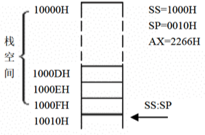
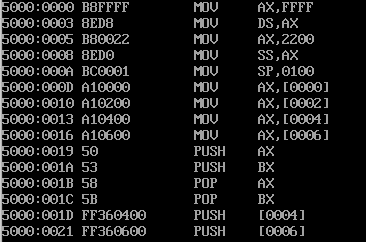

# 3 寄存器内存访问

## 3.1 内存中字的存储

8086CPU中，用16位寄存器来存储一个字。高8位存放高字节，低8位存放低字节。这里，一个字单元的概念：存放一个字型数据的内存单元，由连续两个字节单元组成。


例如，上图中：

- 0地址单元存放的字节数据为：20H，字数据为：4E20H；

- 1字单元存放字数据为：0012H

## 3.2 DS和[address]

8086CPU读取内存单元的地址时，需要给出这个内存单元的地址。该内存地址由段地址和偏移量组成：其中段地址存放在**DS寄存器**中，偏移量由[offset]给出。例如：

```masm
;读取内存地址为10010H的字节数据到al寄存器中
mov bx 1000H
mov ds,bx   ; cpu不知直接数据写入到段寄存器
mov al,[10] ; [10010H] -> al
mov [0],al  ; al -> [10010H]
```

8086有16根数据线，因此也支持在寄存器和内存之间传输字数据：

```masm
;读取内存地址为10010H的字节数据到ax寄存器中
mov bx 1000H
mov ds,bx   ; cpu不知直接数据写入到段寄存器
mov al,[10] ; [10011H] [10010H] -> aX
mov [0],al  ; aX -> [10011H] [10010H]
```

## 3.3 CPU提供的栈机制

栈，一种先进后出的数据结构，8086CPU提供了相关的指令来以栈的方式访问内存：push和pop。

栈在内存空间的的由段寄存器SS和寄存器SP表示，任意时刻SS:SP指向指向栈顶的元素。

```masm
push ax ;ax中的数据入栈, ax --> [SS:SP], SP = SP - 2
pop ax  ;栈顶数据取出到ax, [SS:SP] --> ax, SP = SP + 2
```

如图，栈空间示意图。1000H:0010H指向栈顶，同时1000:0010为栈底位置；当栈满时，SS:IP指向1000:0000H,栈空间为16字节。



push/pop指令除了支持通用寄存器，还支持段寄存器和存储单元：`push/pop ds`或者`push/pop [0]`。

## 3.4 实验二：使用段寄存器

在dosbox，我们在实验一中使用 `d 1000:0` 或者 `u 1000:0` 等命令直接操作指定内存。此外，我们还可以使用直接使用段寄存器：

```masm
-r ds
:1000
-d ds:10 f
-d ss
-e ds:10 11 22 33 44
-u cs:0
```

实验任务：写以下代码，debug观察寄存器和内存变化。


