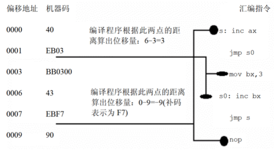

# 9 转移指令

转移指令按转移举例可分为：

- 段内转移，只修改ip，如`jmp ax`
- 段间转移，修改cs和ip，如：`jmp 1000:0`

针对修改ip的范围不同，又可以分为：

- 近转移：ip范围-128～127
- 远转移：ip范围-32768～32767

8086CPU的转移指令可分为一下几类：

- 无条件转移指令
- 条件转移指令
- 玄幻指令
- 过程
- 中断

本章将重点学习无条件转移指令，并且理解其原理。

## 9.1 几种无条件转移指令

1. 操作符offset

```masm
mov ax, offset start ;取得标号的偏移地址
```

2. jmp short指令

    `jmp short 标号`，段内短转移，对ip的修改范围：-128～127，指令结束后，CS:IP指向标号处。对应机器码为`EB+偏移量`，如图所示：



3. jmp far指令

    `jmp far ptr 标号`，段间转移（远转移），修改cs为标号所在的段地址，修ip为标号所在的偏移地址。编译器会将标号翻译为cs:ip的形式，最终为`jmp cs:ip`。

4. jmp reg指令

    转移地址保存在寄存器中，执行后，ip=(reg)，见第2章。 

5. jmp word/dword ptr指令

    `jmp word ptr ds:[addr]`转移地址保存在内存中，段内转移，执行后ip=(addr)

    `jmp dword ptr ds:[addr]`转移地址保存在内存中，段间转移，执行后ip=((ds)*16+addr)，cs=((ds)*16+addr+2)

6. loop指令

    段内短转移指令，机器码中对应的偏移量，而非目的地址。

以上这些指令中，那些根据偏移地址来进行位移的指令，如jmp short，loop，可以方便程序段在内存中的分配。这些指令只需要关心跳转位置同当前Ip的偏移量，忽略段地址。

需要注意的是，在使用转移指令时，如果超处位移限制，编译其将会报错。

# 9.2 实验：屏幕打印输出

```masm
assume cs:codesg,ds:datasg

datasg segment
  db 'hello wrold!'
datasg ends

codesg segment
  start:mov di,0      ;原始数据偏移
        mov bx,0      ;显示区偏移
        mov cx,12

     l1:mov ax,datasg
        mov ds,ax
        mov dl,ds:[di]
        mov ax,0b800h ;彩色显示缓存区第1行
        mov ds,ax
        mov ds:[bx],dl
        mov al,0cah
        mov ds:[bx+1],dl
        add di,1
        add bx,2
        loop l1

        mov ax,4c00h
        int 21h

codesg ends

end start
```
